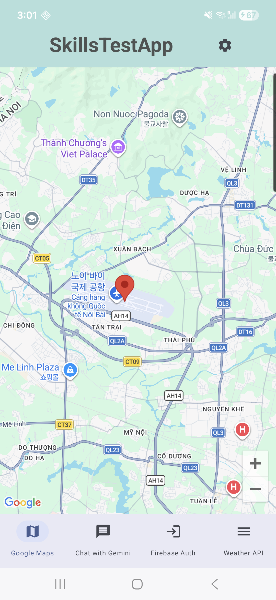
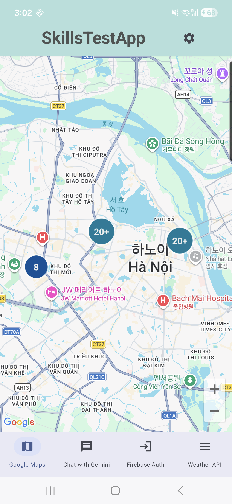
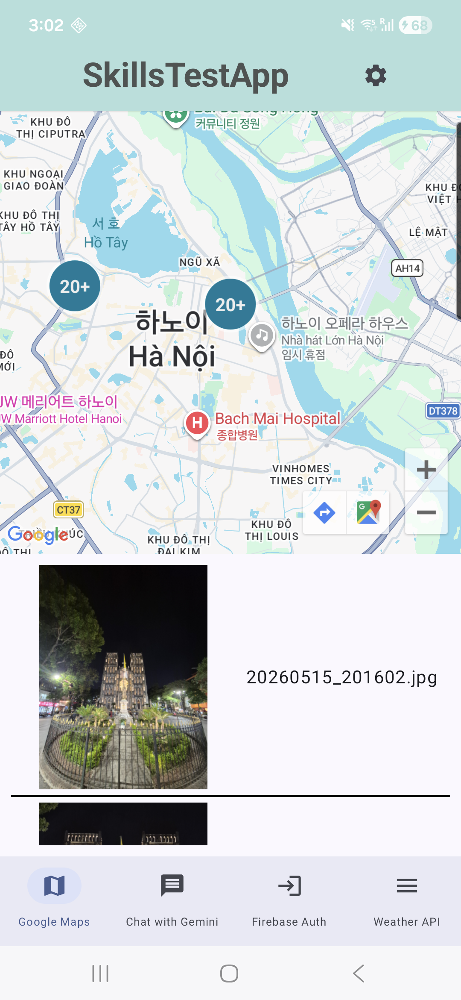
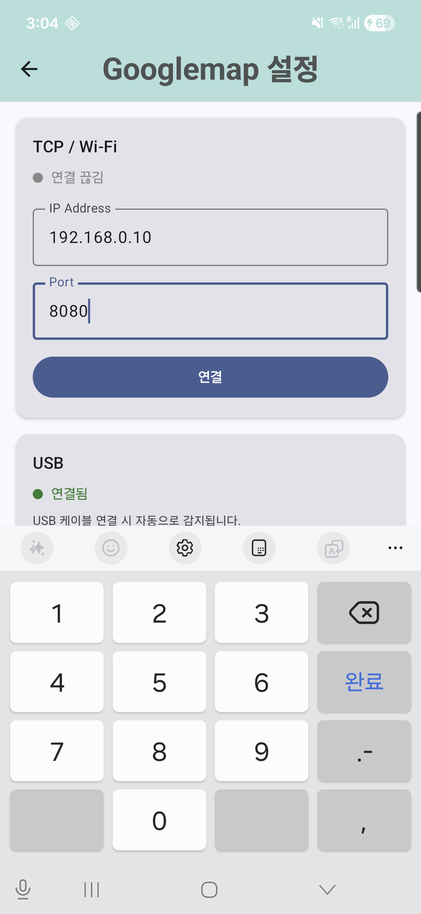
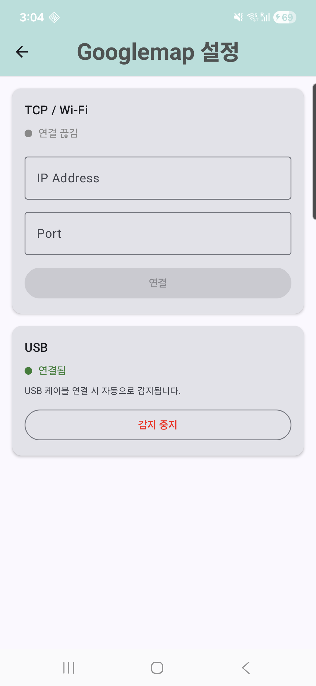
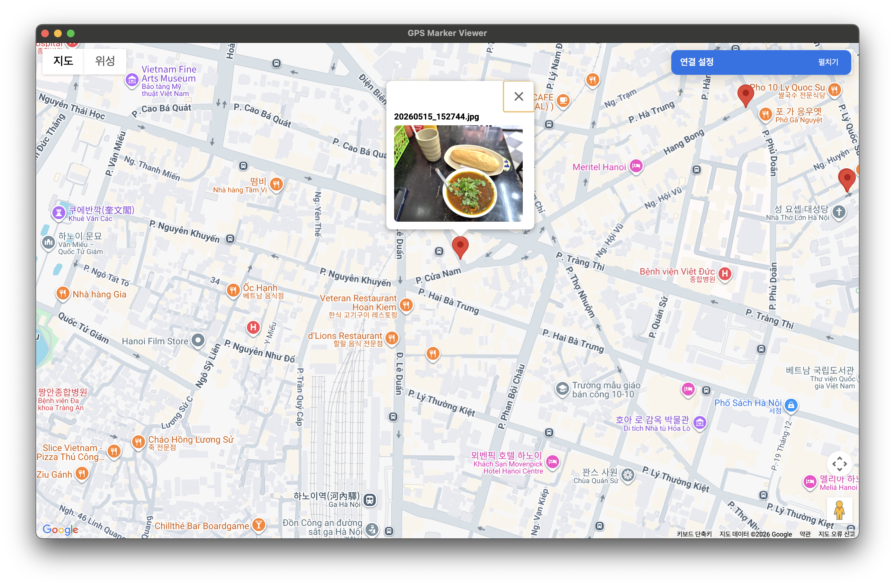
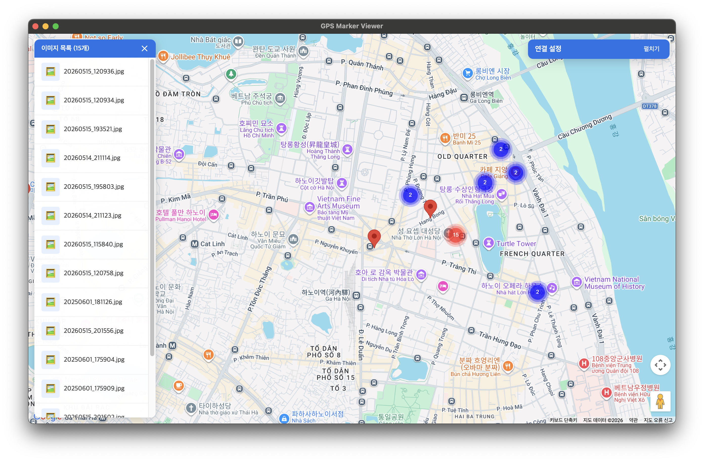
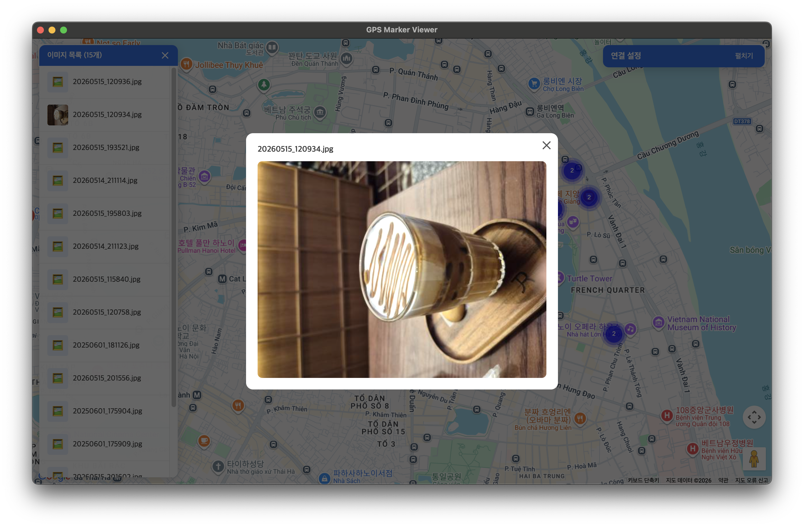
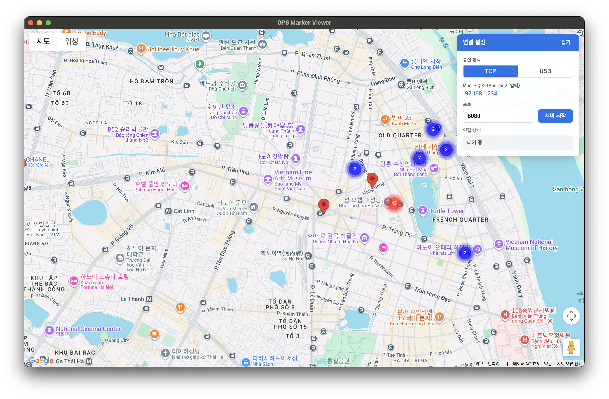
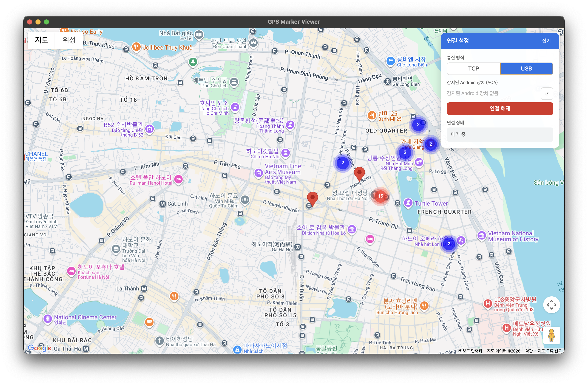

# GPS Marker Viewer — Android ↔ macOS Cross-Platform App


A portfolio project demonstrating local communication between an Android device and a macOS Electron app via **USB AOA (Android Open Accessory)** or **TCP/IP Socket**. The Android app parses GPS metadata from gallery photos, displays markers on Google Maps, and transmits selected marker data in real time to the Electron receiver app.

---

## Key Features

- **Dual transport layer** — USB AOA and TCP/IP switchable at runtime through an abstracted interface
- **Custom binary packet protocol** — designed and implemented on both Android (Kotlin) and Electron (Node.js)
- **Real-time marker sync** — marker/cluster click on Android → instant marker accumulation on macOS
- **Async thumbnail loading** — Electron requests image data, Android responds with compressed thumbnails over the same transport channel
- **Persistent marker storage** — SQLite DB on Electron side restores markers across app restarts

---

## Screenshots

### Android App

| Map — Marker View | Map — Cluster View | Marker Click — Image |
|:-----------------:|:------------------:|:--------------------:|
|  |  |  |


| Settings — TCP | Settings — USB (AOA) |
|:--------------:|:--------------------:|
|  |  |


### Electron App (macOS)

| Map — Marker Accumulation | Cluster Panel — Image List | Thumbnail Modal |
|:-------------------------:|:--------------------------:|:---------------:|
|  |  |  |


| Settings — TCP Mode | Settings — USB (AOA) Mode |
|:-------------------:|:-------------------------:|
|  |  |

---

## System Architecture

```
[Android App]
  Gallery → GPS Parsing → Map Marker / Cluster Display
  → Marker / Cluster Click → PacketBuilder → CMD 0x01
  → DataTransport (UsbTransport or TcpTransport)
        │                              ▲
        │  CMD 0x01 (image list)       │ CMD 0x02 (image request)
        ▼                              │ CMD 0x03 (thumbnail response)
[macOS Electron App]
  DataReceiver (UsbReceiver or TcpReceiver)
  → PacketParser → IPC (Main → Renderer)
  → Maps JS API — Marker accumulation + Clustering
  → Marker Click → CMD 0x02 → Android → CMD 0x03 → Thumbnail display
```

### USB AOA Connection Flow

```
① Android: tap "Start Detection" → UsbTransport registers BroadcastReceiver
② Electron (Mac): node-usb detects Android device → AOA handshake
     ACCESSORY_GET_PROTOCOL → SEND_STRING ×6 → ACCESSORY_START
③ Android: restarts in Accessory mode → ACTION_USB_ACCESSORY_ATTACHED
④ Android: permission granted → openAccessory() → FileStream I/O → Connected
⑤ Packet exchange identical to TCP from this point
   Cable unplugged: ACTION_USB_ACCESSORY_DETACHED → auto Disconnected
```

---

## Packet Protocol

```
[STX 1B][CMD 1B][LENGTH 4B big-endian][PAYLOAD NB][CHECKSUM 1B][ETX 1B]
CHECKSUM = (CMD + LENGTH bytes + PAYLOAD bytes) % 256
PAYLOAD  = UTF-8 JSON byte array
```

| CMD | Description | Direction |
|-----|-------------|-----------|
| 0x01 | Image list (imageID, displayName, lat, lng) | Android → Electron |
| 0x02 | Image data request (imageID list) | Electron → Android |
| 0x03 | Thumbnail response (imageID + Base64 JPEG) | Android → Electron |
| 0x04 | Raw image response (imageID + Base64 JPEG) *(path ready)* | Android → Electron |

---

## Tech Stack

### Android App
| Category | Library / API |
|----------|---------------|
| Language | Kotlin |
| UI | Jetpack Compose |
| DI | Dagger-Hilt |
| Async | Kotlin Coroutines + Flow |
| Map | Google Maps SDK |
| USB | USB Accessory API (AOA) |
| Network | TCP Socket (java.net.Socket) |
| Image metadata | ExifInterface |

### Electron App (macOS)
| Category | Library / Package |
|----------|------------------|
| Framework | Electron ^33 |
| Map | Google Maps JavaScript API |
| USB | node-usb ^2.x (AOA + bulk transfer) |
| Network | Node.js net.Server (TCP) |
| Database | better-sqlite3 (SQLite) |
| Clustering | @googlemaps/markerclusterer |
| Config | dotenv |

---

## Project Structure

```
portfolio-project/
├── android-app/          # Android Studio project (Kotlin + Compose)
├── electron-app/         # Electron project (Node.js)
│   ├── transport/        # UsbReceiver (AOA), TcpReceiver
│   ├── packet/           # PacketParser + builder
│   └── db/               # SQLite marker storage
├── screenshots/
│   ├── android/          # Android app screenshots
│   └── electron/         # Electron app screenshots
└── docs/
    ├── architecture.md
    └── packet-protocol.md
```

---

## Setup

### Prerequisites
- Node.js v18+
- Android Studio (for Android build)
- Google Cloud project with **Maps JavaScript API** and **Maps Android SDK** enabled

### Electron App

```bash
cd electron-app
npm install
npx electron-rebuild          # rebuild native modules (usb, better-sqlite3)
cp .env.local.example .env.local
# edit .env.local → GOOGLE_MAPS_API_KEY=your_key
npm start
```

### Android App

```
1. Open android-app/ in Android Studio
2. Add to local.properties:
   MAPS_API_KEY=your_key
3. Run on device (USB debugging enabled)
```

### Connecting the Apps

**TCP mode**
1. Electron: open Settings panel → TCP → enter port → click "Start Server"
2. Android: open Settings → TCP card → enter Mac's IP and port → Connect

**USB AOA mode**
1. Connect Android to Mac via USB cable
2. Android: open Settings → USB card → tap "Start Detection"
3. Electron: open Settings panel → USB → click "Connect"
4. Electron performs AOA handshake → Android switches to Accessory mode → auto-connects

---

## API Keys

This project requires two API keys, both managed via local config files (`.gitignore`'d):

| Key | File | Variable |
|-----|------|----------|
| Maps JavaScript API | `electron-app/.env.local` | `GOOGLE_MAPS_API_KEY` |
| Maps Android SDK | `android-app/local.properties` | `MAPS_API_KEY` |

---

## CI/CD

| Workflow | Trigger | Artifact |
|----------|---------|----------|
| `android-build.yml` | push / PR to `main` | `app-debug.apk` |
| `electron-build.yml` | push / PR to `main` | Electron build |

---

## Documentation

- [System Architecture](docs/architecture.md) — module structure, DataTransport interface, IPC channels, communication flow
- [Packet Protocol](docs/packet-protocol.md) — frame format, CMD types, payload schemas, checksum calculation

---

## License

MIT
